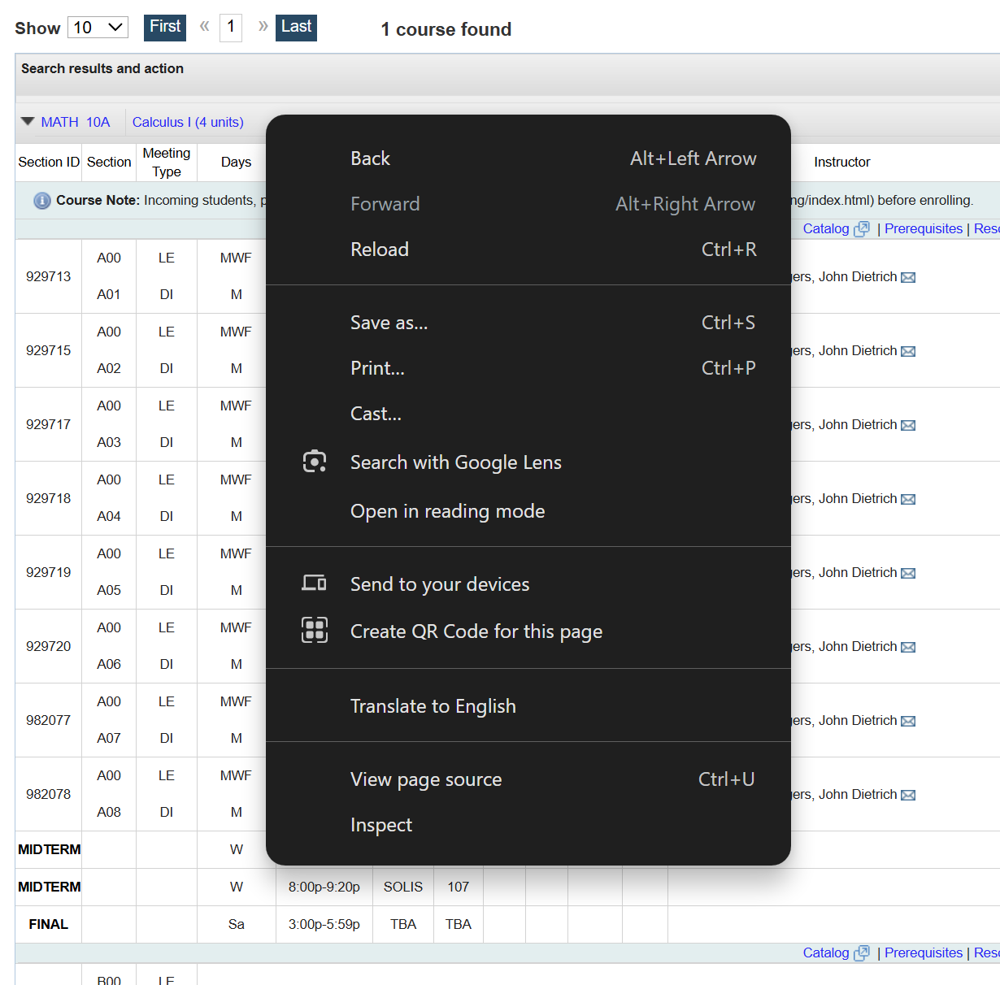
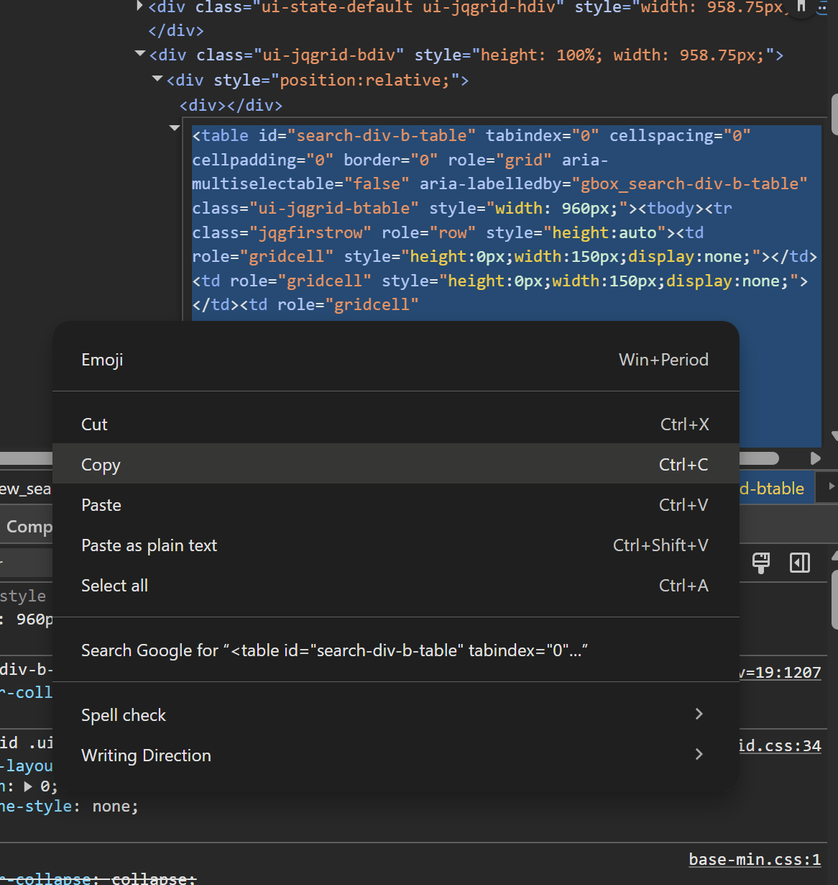

# UCSD Schedule Planner

This program is designed to help you find your perfect UCSD schedule by **visualizing** all possible combinations of classes based on your desired criteria. It will **NOT** access your UCSD login. *Last updated: 8/7/2025 at 9:00 PM PT*

---

## Antivirus Warning
Because this program is distributed as a compiled .exe file without publicly available source code, some antivirus software may flag it as suspicious or unsafe. This is a common false positive for custom executables and does not necessarily mean the file is harmful. Please use caution and run the program in a secure environment if you have any concerns.

---

## Setup

### How to get Class Data from WebReg:

1. Log on to WebReg and search for your desired class
2. Click on the drop-down menu for your class to open it so all of its sections are displayed \
It will look like: `MATH  10A 	 Calculus I (4 units)`
3. Right click on that drop-down menu button again (the one you just clicked) and press inspect

4. Scroll up in the inspect menu until the whole drop-down menu appears selected (like blue) and right click that: press `Edit as HTML`

5. Select all of the text in there by pressing CTRL+A and copy the text

Make an .html file -- `[Your class name].html` You can do this by duplicating one of the already existing sample .html files 
Edit this file with notepad, delete everything in it, and paste from your clipboard.
Save the file and exit.

**Repeat this process for each class.**

The `.html` class files placed in the `\classHtmlFiles` folder determine exactly which classes the program will use. For example, if there are 4 `.html` files in that folder, the program will find combinations of those 4 classes.
Edit the `config.json` file (following the correct JSON formatting) to change the settings according to your preferences.

Once you are done, run the .exe file to see your possible schedules.

---

## Usage
1. Run/double-click the `main.exe` file
2. On the left is a list where you can select each schedule combination
For each class it will display its **Section ID** which you can find on WebReg with CTRL+F after searching for the class to plan/register for it.
Also `(A NUMBER)` is shown next to this which means **the number of other possible sections that could be swapped in** (in case you can't get into that section) \
E.g: `CHEM6A: 123456 (4)` means that there are 4 **OTHER** Chem 6A classes that could be subbed in. \
You can use this fact to see which classes you should **prioritize** during your **First Pass** because you can't register for more than 11.5 units.
#### So you may want to prioritize registering for classes with a (0) next to them.

3. Click on an item in the list to display it
4. The class schedule on the right is similar to how it appears on WebReg's "Calendar" Tab.

---

## Customization
The number of combinations is shown at the top of the program.

The `config.json` settings determine which class _**sections**_ could be fit into your schedule. Please take a look at `SAMPLE_CONFIG.json` for reference

`MAKE_SURE_THESE_SECTION_IDS_ARE_IN_SCHEDULE` : Use this to filter schedules during your second pass enrollment (after you’ve already registered for ~2 classes). Only schedules that include all section IDs listed here will be shown, but the schedule could also include other sections for your remaining classes.
Format: `["12345", "23456"]`

`ONLY_ADD_IF_AT_LEAST_N_AVAIL_SEATS` : Only adds the section if there are at least N available seats
`ONLY_ADD_IF_AT_MOST_N_WAITLISTED` : Only adds the section if there are at most N people waitlisted

`MIN_BREAK_BETWEEN_CLASSES` : The minimum break time in **minutes** between classes. Ignored if consecutive classes are in the same building or are the same (just different meeting types).

`MAX_NUMBER_OF_CLASSES_BEFORE_ABOVE_TIME` : The # of classes that can be before the `TIME` value. E.g. `3` and `9:00a` would mean you could have a MAX of 3 classes before 9:00 AM. 
`TIME` (Above) **Times** are formatted as "8:30a" or "4:00p"
`LATEST_CLASS_START_TIME`

`NO_CLASSES_DURING_RANGE`
You can add multiple ranges of times/days where you don't want classes. 

### For example:

"NO_CLASSES_DURING_RANGE": { \
"MThF": {
      "Time": "11:30a-1:30p"
    } \
}
**This means that you would not have class from 11:30a-1:30p on Monday, Thursday AND Friday.**

"NO_CLASSES_DURING_RANGE": { \
"M": {
      "Time": "11:30a-1:30p"
    }**,** \
"WF": {
      "Time": "6:00p-8:30p"
    } \
} \
**This means that you would not have class from 11:30a-1:30p on Monday and no classes from 6:00p-8:30p on Wednesday AND Friday**

"MF" does not indicate a range, this is Monday and Friday. Separate ranges by commas as shown.

`MAX_CLASSES_PER_DAY` : The maximum # of classes per day

`MAX_DAILY_HOURS` : The maximum **total** daily hours in the below types of meetings: (E.g. if you don't want to exceed 5 hours sitting in Discussions and Lectures but don't mind lab time) \
`DAILY_HOURS_MEETING_TYPES` : A list separated by commas (follow formatting and retain quotes)

`OMIT_INSTRUCTORS` : Another list -- make sure the instructor's name is pasted exactly as it is on WebReg
